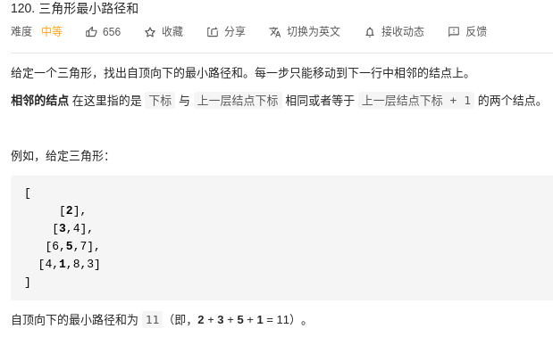
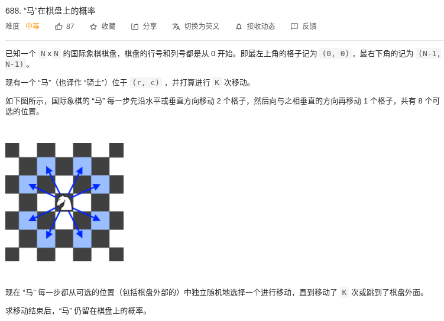
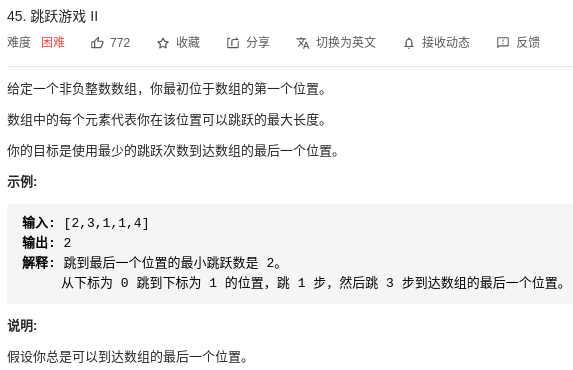

# Dynamic Programming 详细介绍

下面我们简单的介绍动态规划，我将会从三个方面来介绍这种算法，what（是什么），where（在哪里使用），how（如何使用以及基本的题型）。
# what




那么具体什么是动态规划呢？用一句简单的话来概括就是，一种具有规律性质的解决问题的迭代方法。举个例子来讲，力扣120三角形路径问题，想要找到一个路径的和是最小的那个，那么我们怎么来解决这个问题呢？我们先找规律，首先路径的定义是从顶点到底部的一根路径而已，所以我们可以从top出发，也可以从bottom出发。如果从top出发的话，我们没办法保证下一步选定的路线一定是最小的，但是从底部可以，因为本质上这是三角形具有一种发散的特质。所以这种规律长成这个样子：先从最底下开始找最小的数字，“1”，然后从1对应的两个可能路径选出最小的那个，“5”， 再然后有“4”，“3”两个选项，那肯定选择“3”，然后再然后选择顶部的“2”，所以说路径最终就是1-5-3-2，这样就完成了路径的规划。而在这其中，有一种规律在里面，那就是从开始往上面去找，找到相对来说比较小的那个路径。这就用到了动态规划思想。

而对于动态规划来说，有四个基本的概念
- state（状态表示）
- function （转移方程）
- initial （初始化）
- final state （最终的状态）

而对于state来讲，我们首先需要构建一个存储我东西的数组，然后每一个格子代表了当前来讲最短的路径是多少。我们用一组array来表示，dp = [0, 0, 0, 0]，array的长度也即是层高，第一个代表了最后一层的路径和，第二个代表了后两层的路径和，第四个代表了总共的路径和。而对于function来讲，我们需要找到一种转移方程，也即 dp[i] = dp[i-1] + min(两个分支)。接下来就是初始化，我们全部把dp的数值初始化为0，然后就可以推导最终的状态表示了，也即dp[0] = 1, dp[1] = dp[0] + min(5, 6) = 6, dp[2] = dp[1] + min(3,4) = 9, dp[3] = dp[2] + 2 = 11。所以我们得到了最终状态的数值，也即是11这个数值。

# where
- max/min
- bool
- number

我做过很多的动态规划的题型之后，发现主要集中在三个方面，第一个是求一个最大值、最小值，第二个是判断方案是否可行，第三个是在求方案的个数。刚开始看的时候会觉得有点懵，但是当看到我对于每一种题型的仔细讲解之后你就会明白的，细心的你可以做得到的。

# how
至于如何使DP方面，敲重点啦，我们会通过题型来讲解。坐标型是代表着输入是一种坐标的形式，一种矩阵的形式。序列型的意思是输入是一种字符串或者array的形式。双序列型的意思是由两个array/list共同求解DP问题，例如最长公共子序列问题。对于区间型DP问题来讲，状态自然定义为f[i][j]，表示面对子序列 [i, ..., j ]时的某种最优性质。划分型的意思是给定长度为N的序列或字符串，要求划分成若干段。背包型问题非常出名，主要是用在了一些特殊的问题上面，比方说有一堆包，包的容纳可容纳重量是[5,5,8]，以及一堆水果，水果的重量是[1,5,5,2,4]，然后问可容纳的最大的重量是多少？背包型问题是计算机常见的一种算法问题，属于分配资源的一种最优化问题。


- 坐标型 
- 序列型
- 双序列
- 区间型
- 划分型
- 背包型
    - 有限制背包问题 
    - 无限制背包问题


| # | Title | Class | Basic idea (One line) |
|---| ----- | -------- | --------------------- |
|688 | 马在棋盘上的概率 | 坐标型 | Fuck you, body! |
|45 | 跳跃游戏II | 序列型 | Fuck you, body! |
|1143 | 最长公共子序列 | 双序列 | Fuck you, body! |
|4 | 最长回文子串 | 区间型 | Fuck you, body! |
|274 | 完全平方数 | 划分型 | Fuck you, body! |
|688 | 马在棋盘上的概率 | 背包型I | Fuck you, body! |
|688 | 马在棋盘上的概率 | 背包型II | Fuck you, body! |

# Leetcode 688-马在棋盘上的概率
### 题目描述：

首先来分析一下这个问题，输入有N（棋盘大小），移动数目（k），（r，c）初始坐标所构成。然后马来跳（走日），然后最终输出马在棋盘上的概率的大，假设马可以随表跳跃的话。这是一种DP问题，因为马走第二次依赖于前面的走法，而且能够找到一种规律在里面。下面我们来仔细的讲解一下这个问题，首先我们用计算次数来计算概率，用次数乘以八分之一（马总共可以有八种跳法）来得到最终的概率数值。至于dp array的构造，我们用三维矩阵来构造。

- state = dp[k][i][j] ：在k步之后可以移动到坐标[i,j]的次数，
- function ： dp[k][i][j] = sum(dp[k-1][x][y], for all (x,y) can move to (i,j))
- initial：初始化为全0
- final state：最终状态就是dp[k][i][j]
- O(time)：O(k^8), 加上记忆化搜索可以得到显著的效果提升
- O(space)：O(k* N^2) 也即DP 状态的大小，可以优化成O(2*N^2)，也即用两张表格来交替记录。

```
import numpy as np
class Solution:
    def knightProbability(self, N: int, K: int, r: int, c: int) -> float:
        # 初始化
        k = K
        dp = np.zeros((k+1,N,N))
        dp[0][r,c] = 1
        option = [[-2,1],[-1,2],[1,2],[2,1],[2,-1],[1,-2],[-1,-2],[-2,-1]]
        axis = [[] for i in range(k+1)]
        axis[0].append([r,c]) 

        # start repeating
        for k in range(k):
            print(dp[k])
            while axis[k]:
                value = axis[k].pop()
                for ele in option:
                    times = dp[k][value[0]][value[1]]

                    new_row = ele[0] + value[0]
                    new_col = ele[1] + value[1]

                    if 0 <= new_col < N and 0 <= new_row < N:
                        dp[k+1][new_row,new_col] += 1*times
                        if [new_row,new_col] not in axis[k+1]:
                            axis[k+1].append([new_row,new_col])
                
                # 如果没有了就break
        k = K
        print(dp[k])
        # 得到最终的效果
        result = (np.sum(dp[k])/pow(8,k))
        return result
```
# Leetcode 45 跳跃游戏II
###题目描述

首先来分析一下这个问题，输入是一个array，代表了从当前位置可以跳跃的最大步数，然后问最少跳跃多少步就可以跳出这个array。这是一个典型的DP问题，因为第二个状态会依赖于前面的状态。我们用经典的思路去解决这个问题：

- state = dp[i]，当前跳跃到i至少需要的步数。
- function ： dp[i] = min(dp[j] + 1) for j could jump to i
- initial：初始化为全0
- final state：最终状态就是dp[-1]

但是不知道小伙伴们有没有发现，这个问题实际上用DP解决有点慢了，因为对于跳跃游戏来说，第一次跳到i的步数肯定是最少的，所以本道题目贪心算法来解是最好的！而后面跳到i的肯定是之前已经能够跳跃到的地方，所以本题目运用贪心算法来优化。
```
class Solution:
    def jump(self, nums: List[int]) -> int:
        n = len(nums)
        if n == 1 : return 0
        dp = [0] * n

        for i in range(n):
            for j in range(nums[i], 0, -1):
                # meet the end, return
                if i + j >= n - 1 : return dp[i] + 1
                
                elif dp[i + j] == 0:
                    dp[i + j] = dp[i] + 1
                
                else:
                    # if second time: break
                    break
```


## Tree
 - Background 
 
| # | Title | Solution | Basic idea (One line) |
|---| ----- | -------- | --------------------- |
|4 | preorder | here it is | Fuck you, body! |


### for writing a code
```
npm install --global standard-readme-spec
```


## License

[MIT](LICENSE) © Zhengxu(Raleigh) Hou


