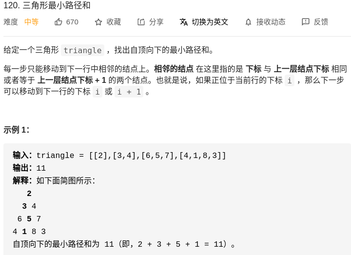
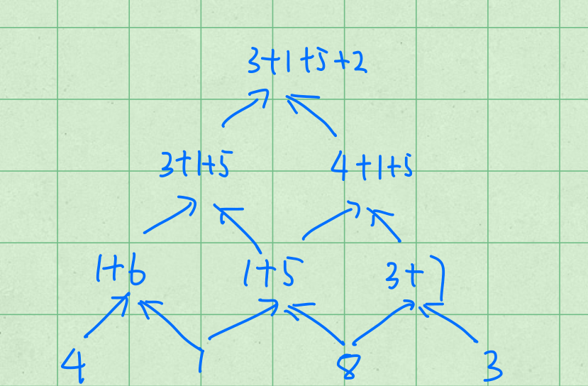

# Dynamic Programming

今天小编来介绍介绍面试中经常出现的题目：动态规划！


动态规划（Dynamic Programic）是计算机科学领域的一个概念，它是一种特殊的分治思想，利用它可以实现时间复杂度的优化。Dynamic
是动态的意思，也就是变化的，programing应该理解为【表格法】。结合起来就是动态规划是用一张可变的表格来计算变量的算法。
我们下面会先详细介绍一下什么是动态规划（what），然后介绍在哪里使用（where），
最后通过详细地介绍一道题目来介绍这种算法，也即（how）。

# what
在解释动态规划的时候，我们顺便理一理和它相关的两种思想--分治和贪心算法。
- 分治：最优子结构
- 动规：最优子结构、重叠子问题
- 贪心：最优子结构，重叠子问题，贪心选择性质

### 分治
为了解决一个问题，这种算法会把根问题分解成若干个子问题，这样的能分解性质就是最优子结构的。最简单的例子就是小明在解决问题A的时候，发现问题A是由问题B和C一起组成的，所以他想要解决问题A，就需要把B、C一起去解决。

### 动态规划
动态规划是分治法的特例。但是动态规划比分治法多了一种，就是重叠的子问题，那么什么是重叠的子问题呢？举个例子来讲，可爱的小明遇到了一个问题，那就是问题A，但是在前面需要解决一连串的问题，我们用```A1，A2，A3，A4 ...  A```来表示，在解决```A1```之后会用它的解去解决类似的问题```A2```，
然后再去解决```A3```。最终再去解决A，这就是重叠的子问题的典型代表。

### 贪心
贪心比动态规划更加的特殊，它还需要问题满足另外一个性质--贪心选择性质，每次都可以把原问题分解成为一个子问题。实际上再用动规的例子来说明贪心，在解决```A1，A2，A3，A4 ...  A```的时候，他发现解决不光有一种重叠子问题的性质在里面，更有趣的是，解决```A1```需要一种特殊的规则。例如小明现在在玩电脑游戏，而电脑游戏的最终目的是到达```A```，而他又发现，只要一直往右边走就能到达最终的目的地了。这就是一种贪心的算法，在每次往右边走，就是一种特殊的规则，而走到目的地```A```需要很多重复的子问题，也即每次活动一个单位。

而对于动态规划来说，有四个基本的概念
- state（状态表示）
- function （转移方程）
- initial （初始化）
- final state （最终的状态）

在刚开始的时候，我们首先需要构建一个存储东西的数组，然后设定每一个格子到下一个格子需要的转移方程。
然后去执行重复的步骤，从初始化的状态一直计算到最终需要的状态。

回到动态规划的例子，刚开始的时候小明需要确定一个state（A0代表的是什么），
然后找到```A0```与```A1```之间的关系，
从初始化开始一直计算到最终的状态。

# where
- max/min
- bool
- number

我做过很多的动态规划的题型之后，发现主要集中在三个方面，第一个是求最值（max/min），
第二个是判断方案是否可行（bool），第三个是在求方案的个数（number）。
为什么这样讲呢？实际上是因为动态规划不像回溯算法能够求出每个方案的具体路径，
它只是能够计算出一些抽象的代表，例如一个问题，把大象放冰箱总共最少需要几步？
动态规划回答说三步。而如果问题变成，请列举出所有的方法，这就用回溯法来解决这个问题了。
回溯法可能是：先把冰箱扩大，再把大象放进去，或者是先把大象缩小，再把大象放进 冰箱里面去。


# how
接下来，我们会详细的解释一个动规的问题，并且用图像的形式把我的想法画下来便于大家的理解。我们以leetcode 120来详细的讲解这个算法。

## 题目描述




现在我们来分析一下这个题目，首先我们分析一下为什么它是一个动态规划的问题。
题目的意思是要找到一种路径的和，这种路径和是要最小的，满足了我们的 ```where```的最值条件，
接下来是```what```。实际上因为这是路径，我们就是在每一层里面选择一个合适的数字，
然后连成一个路径，在这道题目里面，最小的路径是```2-3-5-1```，
在第一层挑了```2```，在第二层挑了```3```。也就是说总的问题拆分成了每一层的问题，
而每一层之间都有一种依赖性在里面，例如第二层选择了```3```之后只能在```6,5```之中选择一个，这就是```重叠子问题```。


我们用```f[i][j]```表示从三角形顶部走到位置 ```[i][j]``` 的最小路径和。这里的位置 ```i, j``` 指的是三角形中第 i 行第 j 列的位置。
由于只能是从一个节点到相邻的两个节点（树），因此要想走到位置 ```[i][j]```，上一步就只能在位置 ```[i-1, j-1]``` 或者位置 ```[i-1][j]```。
我们在这两个位置中选择一个路径和较小的来进行转移，状态转移方程为：```f[i][j]=min(f[i−1][j−1],f[i−1][j])+c[i][j]```，其中c的意思代表了```triangle[i][j]```的数值。

### 方法一

当设定完方程式之后，我们需要设定一些特殊的转化方程，当计算靠近左边边界的列的时候，我们只能够把计算来自上一行的，有```f[i][0]=f[i−1][0]+c[i][0]```
当计算靠近右边边界（对角线的时候）我们直接用上一层斜上角位置的数值进行计算。
```f[i][i]=f[i−1][i−1]+c[i][i]```最终，我们只需要在dp三角形的最后一行找到最小值就可以了。那么初始的状态是什么呢？
实际上就是刚开始的时候设定dp的第一个单位的数值为```cp[0][0]```，也即是```dp[0][0]=c[0][0]```。状态转换图如下所示：


如此一来，我们只需要慢慢的一层一层的计算就能够找到最终的答案了，下面是最终的程序：

```python
class Solution:
    def minimumTotal(self, triangle: List[List[int]]) -> int:
        n = len(triangle)
        if n == 0:
            return 0
        # 创建DP的空间
        dp = [[0] * i for i in range(1, n+1)]
        dp[0][0] = triangle[0][0]
        # 动态规划的方程式
        for i in range(1, n):
            for k in range(i + 1):
                if k == 0:
                    dp[i][k] = dp[i - 1][k] + triangle[i][k]
                elif k == i:
                    dp[i][k] = dp[i - 1][k - 1] + triangle[i][k]
                else:
                    dp[i][k] = min(dp[i - 1][k - 1], dp[i - 1][k]) + triangle[i][k]
        return min(dp[-1])
```


下面来分析这个问题的时间复杂度以及空间复杂度，动态规划是一种典型的空间换时间的算法，一般来说空间复杂度是就是DP表格的大小
在这道问题中是$O(n^{2})$，而对于时间复杂度来说，就是整个dp的遍历次数，而在这个问题中我们只进行了一次遍历，也即一个矩阵的遍历，所以是$O(n^{2})$。

上述的空间复杂度是在$O(n^{2})$，而如果想要优化到n，我们需要怎么做呢？实际上这个就涉及到了一种**状态压缩**的方法，也即压缩这个状态表。
那么怎么去压缩呢？

实际上这个问题比较简单，因为```dp[i][j]```仅仅与上一层的状态有关，所以说与前两层的是
没有任何关系的，因此我们不必存储这些无关的状态。实际上最简单的状态压缩就是保留好前两个状态即可，例如在计算第四行的时候，
保留第三行以及第二行的状态表，然后交替的进行更新就可以啦。

```python
class Solution:
    def minimumTotal(self, triangle: List[List[int]]) -> int:
        n = len(triangle)
        f = [[0] * n for _ in range(2)]
        f[0][0] = triangle[0][0]

        for i in range(1, n):
            curr, prev = i % 2, 1 - i % 2
            f[curr][0] = f[prev][0] + triangle[i][0]
            for j in range(1, i):
                f[curr][j] = min(f[prev][j - 1], f[prev][j]) + triangle[i][j]
            f[curr][i] = f[prev][i - 1] + triangle[i][i]
        
        return min(f[(n - 1) % 2])
```
这个的空间复杂度是$O(2n)$，能不能压缩成严格意义上的$O(n)$呢？
那么再往后是否还能够进行状态的压缩呢？答案是可以的，我们可以再想一种方程然后达到最优的空间复杂度的目标。
当我们在计算位置 ```[i][j]``` 时，```f[j+1]``` 到 ```f[i]``` 已经是第 ```i``` 行的值，而 ```f[0]``` 到 ```f[j]``` 
仍然是第 ```i-1``` 行的值。此时我们直接通过
```f[j] = min(f[j−1], f[j]) + c[i][j]```来计算，
但是这个时候我们需要j是倒着遍历的，因为这样才不会影响之前记录下的状态。
如果从1开始，那么计算2的时候就会用到新的1的数值而不是上一层1的数值。
程序如下：

```python
class Solution:
    def minimumTotal(self, triangle: List[List[int]]) -> int:
        n = len(triangle)
        f = [0] * n
        f[0] = triangle[0][0]

        for i in range(1, n):
            f[i] = f[i - 1] + triangle[i][i]
            for j in range(i - 1, 0, -1):
                f[j] = min(f[j - 1], f[j]) + triangle[i][j]
            f[0] += triangle[i][0]
        
        return min(f)
```


### 方法2

方法1有点难以理解，如果从方法2来理解，就会变得很简单。我们可以直接从结果出发，
因为这个问题是一个**发散三角树**的问题，我们可以直接从最后一行出发，然后每一行每一行的进行一种递推得到，那么第一行就是最终的结果了。
举个例子来说，如下所示：

```
 1
1 2
```

如果从最底下往上出发，实际上找最小值方法的规律很容易找到，那就是在第二行```[1， 2]```里面选择一个就可以了，因为他们两个都要走到根节点。
所以说初始状态我们更改为dp的最后一行，最终状态为第一行的数值输出为最小的路径和。那么接下来就是动态规划的状态转移方程的问题了，
我们先用二维的转移矩阵来解释这个问题。用这种方法也不必考虑像第一种解题思路的边界条件了。
```dp[i][j]=min(dp[i+1][j],dp[i+1][j+1])+c[i][j]```

状态转换图如下所示：


```python
class Solution:
    def minimumTotal(self, triangle: List[List[int]]) -> int:
        n = len(triangle)
        if n == 0:
            return 0
        # 创建DP的空间
        dp = [[0] * i for i in range(1, n+1)]
        for i in range(len(triangle[-1])):
            dp[-1][i] = triangle[-1][i]

        # 动态规划的方程式
        for i in range(n-2, -1, -1):
            for j in range(len(triangle[i])):
                dp[i][j] = min(dp[i+1][j], dp[i+1][j+1])+ triangle[i][j]
        return dp[0][0]         
```

那么在进行状态压缩的时候，我们该怎么去做呢？实际上就是只用一个状态表来表示所有的。
因为只是和上一个状态相关，所以说可以表示成如下的形式：
```dp[j] = min(dp[j], dp[j + 1]) + triangle[i][j]```，
```j```就是列的意思，我们只用j来代表当前的状态，然后最终输出dp[0]即可。

```python
class Solution:
    def minimumTotal(self, triangle: List[List[int]]) -> int:
            row = len(triangle)
            dp = [0] * row
            for i in range(len(triangle[-1])):
                dp[i] = triangle[-1][i]
            #print(dp)
            for i in range(row - 2, -1, -1):
                for j in range(i + 1):
                    dp[j] = min(dp[j], dp[j + 1]) + triangle[i][j]
            return dp[0]
```

# 总结
以上就是动态规划的由浅入深的介绍，总的来说，我们需要注意动态规划的这么几件事情。
    
1.确定是否需要用动态规划

2.确定动态规划的四个部分，state, function, initial, end

3.书写程序

实际上需要注意的是 function 部分，这个地方会非常的难想，确实需要大量的积累才能够在面试的时候轻而易举的想出来。
最后祝各位刷题刷的顺利，加油呀！


