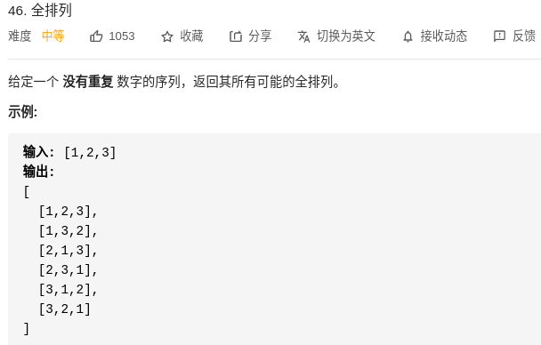
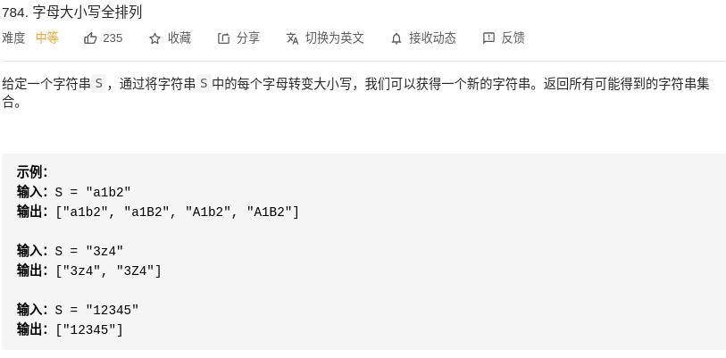
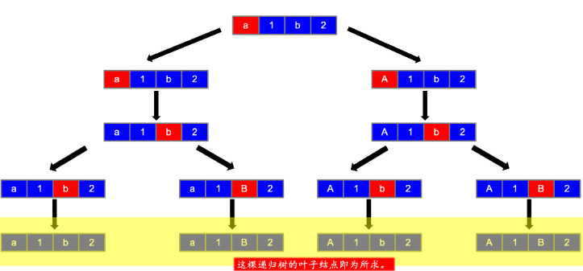
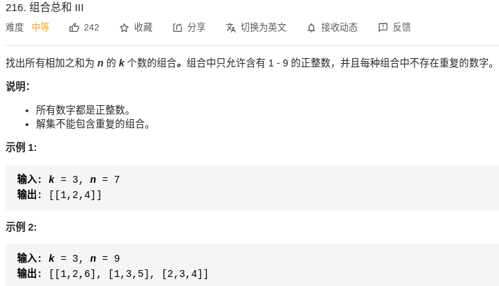
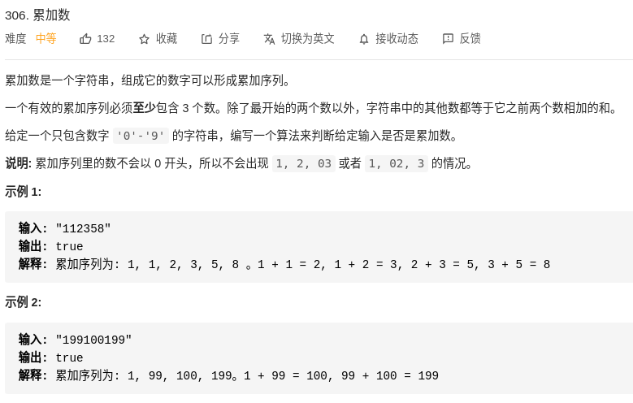
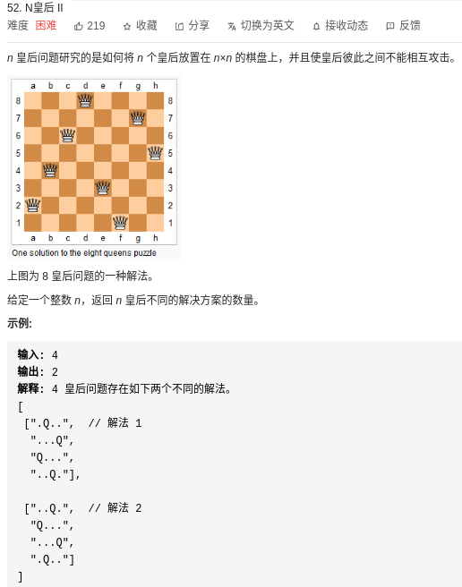
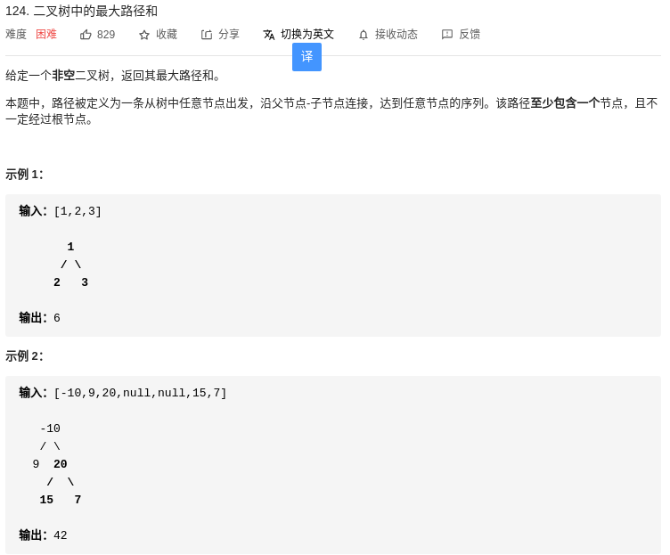
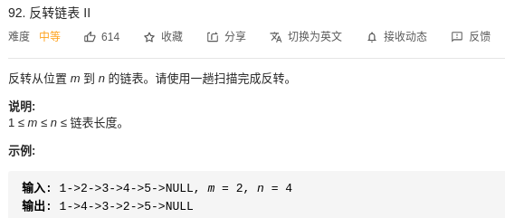
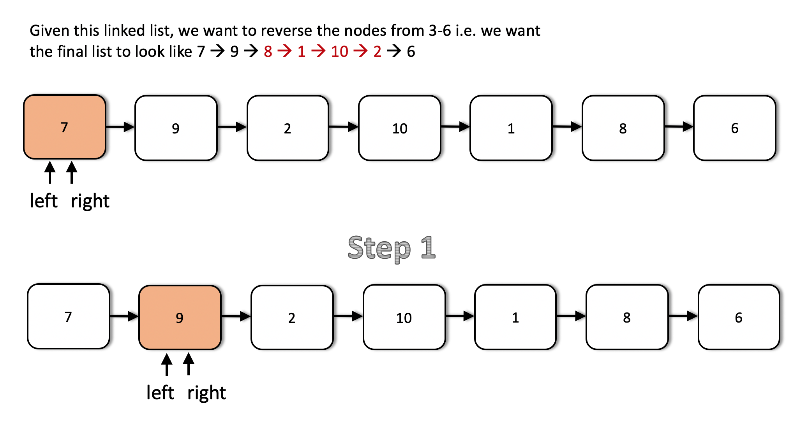

# Recursion 详细介绍

下面我们简单的介绍动态规划，我将会从三个方面来介绍这种算法，what（是什么），where（在哪里使用），how（如何使用以及基本的题型）。
# what
那么首先，什么是递归算法呢？一句话来介绍，能够反复调用同一个程序就是递归算法，最简单的例子就是俄罗斯套娃，
想要看到最终的里面的样子，是需要我们一个一个去解开这种套娃的，实际上是在做相同的操作，也就是解开重复的套娃来得到最终的结果。


而对于这种算法结构来说，和动态规划一样，主要由三个部分组成，以俄罗斯套娃来举例，出口就是娃娃是最小的不能再拆分了，而入口的条件就是可以拆分，而返回的东西是娃娃的数目（深度），所以从一定程度上来说，只有当娃娃不可分开的时候，递归程序才会结束。
而依据小编的经验，一般来说刷递归题目的时候确实需要我们把出口，入口以及返回的条件说清楚就可以了。

- exit，标准的出口
- entrance，开始递归
- return，返回到上一层

# FAQ
1. DFS, BFS, 回溯，递归的区别是什么呢？
    Answer: 递归是一种算法的具体结构，就是说不断调用自己的程序。
    而回溯，DFS，BFS是一种算法的思想，他们的意思是搜索的一种思想，是通过深度（Depth）优先或者广度（Breadth）优先来搜索的。
    回溯是一种特殊的记忆化搜索的方式，属于DFS，和DFS的区别是回溯不可以保留整个搜索数的样子，
    而DFS是可以的，一般来说，回溯更倾向于尝试出所有可能的解，有点类似于排列组合的感觉。
    所以说递归是包括前面的三者的，递归的题型可以用DFS来做的，而DFS的题目是可以由回溯来做的。
    

# where
那么在哪里使用递归算法呢？实际上递归算法有两种常见的模式，第一种是父子递归，第二种是分治法，
父子递归指的是这种题型需要一种拆分的思想，类似于俄罗斯套娃的思想，而分治法的意思是一种分开的方法，
常常用在二叉树上，左子树和右子树会进行一种分开然后再合并处理的操作。所以说碰到这两种题型就可以使用递归了呢～

# 技巧
递归的一些小技巧，在到达终点的时候就进行一种判断。

一般的返回结构
- list
- max
- number
- None, and plus global paramater.
# how

| Leetcode # | Title | Class | Solution|
|---| ----- | -------- | ---------| 
|46 | 排列 | 排列问题 | 回溯
|784 | 字母大小写全排列 | 排列问题 | 回溯
|216 | 组合总和III | 组合问题 | 回溯+剪枝
|306 | 累加数 | 组合问题 | 回溯
|52 | N皇后II | 组合问题 | 回溯
|124 | 最大路径和 | 树结构 | dfs
|206 | 翻转链表 | 链表结构 | dfs
 
# Leetcode 46-全排列
### 题目描述：



这道题目在我们初中高中的时候经常遇到，就是返回所有可能的全排列的方案，而还记得我们在讲动态规划的时候，一旦涉及到返回具体方案的问题,
基本就不能用动态规划来解决了。对这道问题，实际上我们的入口可以设置成for循环的方式，来选择进入的，出口可以设置成当长度为n的时候，记录并且退出递归
而返回的数值可以是当前列表的所有全部排列的组合。所以我们可以写成以下的形式：
- exit, when len(nums) <= 1
- entrance, using for loop to get inside
- return, return the list of answers 
所以按照排列组合的基本思想，当n=4的时候，总共路径有4×3×2×1 = 4！。而对于空间复杂度，总共返回的列表的长度就是空间复杂度了。
- O(time)：O(n!)
- O(space)：O(n!)

```
class Solution:
    def permute(self, nums: List[int]) -> List[List[int]]:
        if len(nums) <= 1:
            return [nums]
        answer = []
        for i,num in enumerate(nums):
            n = nums[:i] + nums[i+1:]
            for y in self.permute(n):
                answer.append([num]+y)
        return answer
```

# Leetcode 784-字母大小写全排列
### 题目描述：



这道题目也是排列的基本一道题目，就是把所有的字母都分别用大写，小写来尝试一遍。类似于全排列的问题，但是但是又有一些不一样的地方，
那就是这个题目实际上是在用一种分治的的方法来解决问题，比如给了一个字母```a```,那么从这个节点出发实际上有两条路可以走，一个是A，另外一个是a，接着再处理a之后的字母，

- exit, 当index走到头的时候，```self.dic```用来记录所有出现过的情况 
- entrance, 利用for循环，当letter是字母的时候，就进行大写和小写两种递归
- return, None，小编做题习惯不返回东西，用全局变量来记录搜索结果即可（省了debug）
- O(time)：O(2^n*n)
- O(space)：O(2^n*n)
小编把这道题目的算法画了出来，是一种类似于树结构的DFS思路。



```
class Solution:
    def __init__(self):
        self.dic = set()

    def letterCasePermutation(self, S: str) -> List[str]:
        self.leng = len(S)
        self.dic.add(S)
        self.repeat(S, 0)
        # print(self.dic)
        return list(self.dic)

    def repeat(self, s, index):
        """
        :params: s, the string wait for process.
        :params: index, the index for next process, to avoide duplication.
        """
        # exit, when should this exit? when the index is going to the end
        if index == self.leng:
            return
        # inside
        for i in range(index, self.leng):
            ele = s[i]
            if not ele.isnumeric():
                # upper
                s_upper = s[:i] + s[i].upper() + s[i+1:]
                # memory search
                if s_upper not in self.dic:
                    self.dic.add(s_upper)
                    self.repeat(s_upper, index + 1)
                # lower
                s_lower = s[:i] + s[i].lower() + s[i+1:]
                # memory search
                if s_lower not in self.dic:
                    self.dic.add(s_lower)
                    self.repeat(s_lower, index + 1)
        return
```

# Leetcode 216-组合总和III
### 题目描述：


这道题目和全排列的题目有异曲同工之处，不一样的地方是这个需要用index来标记出走到了哪里。

- exit, 当index走完的时候
- entrance, 通过for循环来进入，开始为index
- return, return the list of answers 

- O(time)：O(n!)
- O(space)：O(n!)

```
class Solution:
    def combinationSum3(self, k: int, n: int) -> List[List[int]]:
        nums = [1,2,3,4,5,6,7,8,9]
        # self.n = n
        self.nums = nums
        self.res = []
        ans = self.repeat([],k,n,0)
        print(ans)
        return ans

    def repeat(self,nums,k,n,index):
        # 一直在减去东西
        # 返回的形式是这个res的list里面有list的结构哦。
        if k == 0 and n == 0:
            return [nums]
        if k == 0 and n!=0:
            return []
        if k<0:
            return []

        # 还得设置这个错误的出口呢。
        res = []
        for i in range(index,len(self.nums)):
            val = self.nums[i]
            for element in self.repeat(nums + [val], k - 1, n - val,i+1):
                res.append(element)
        return res
```

# Leetcode 306-累加数
### 题目描述：


这道题目是一种典型的dfs搜索题目，最终的效果就是要达成一种累加的形式。这道题目并没有用到for循环来一个一个的尝试，
相反的，它只是用到了一个```tmp```的数组来维持长度为三的一个等式，能放进去的时候就放进去，不能的时候就输出false，
而在放数字进去的时候，确实用到了for循环在里面，用来对一些可能的数字进行一种循环输入。

- exit, 当index到达最后的时候或者当不满足条件的时候（剪枝）
- entrance, 利用for循环一个一个输入数字，然后利用temp来维持数组，进行等式的判断
- return, bool

- O(time)：O(n!)
- O(space)：O(n!)

```
class Solution:
    def isAdditiveNumber(self, num: str) -> bool:
        self.num = num
        self.leng = len(num)
        self.res = False
        self.repeat([],0)
        print(self.res)
        return self.res

    def repeat(self,tmp,index):
        
        if not tmp or len(tmp) <= 2:
            for i in range(index,self.leng):
                num = (self.num[index:i+1])
                # 判断非0开头即可。
                if num[0] == "0" and len(num)>=2:
                    return False
                # 第一种入口的情况
                if self.repeat(tmp+[int(num)],i+1):
                    return True

        if len(tmp)==3:
            # 当长度为3的时候可以进行一种判断
            if tmp[0]+tmp[1]==tmp[2]:
                tmp.pop(0)
                if index == self.leng:
                    self.res = True
                    return True
                else:
                    # 继续执行
                    self.repeat(tmp,index)
            else:
                return False
```

# Leetcode 52-N皇后II
### 题目描述：



这道题目作为N皇后的升级版本，是一道非常经典的递归问题，解决的方案用DFS来解决即可，
皇后的走法是：可以横直斜走，格数不限。因此要求皇后彼此之间不能相互攻击，等价于要求任何两个皇后都不能在同一行、同一列以及同一条斜线上。
回溯的具体做法是：依次在每一行放置一个皇后，每次新放置的皇后都不能和已经放置的皇后之间有攻击，即新放置的皇后不能和任何一个已经放置的皇后在同一列以及同一条斜线上。当 NN 个皇后都放置完毕，则找到一个可能的解，将可能的解的数量加 1。
而在代码实现当中，我们会用一个rules来表明哪些点是不能放置皇后的，然后来进行剪枝操作。我们用level来定义当前的深度（行的索引），然后用rules来规定一些不可以到达的点。

- exit, 失败出口是当点位于rules中，成功出口是level到达了最后一层
- entrance, 进入之后对每一行可能的坐标进行遍历
- return, None

- O(time)：O(n!)
- O(space)：O(n)

```
# 40min + 思路都对了，就是写不出来，是我的细节的问题了。
# from collections import defaultdict
class Solution:
    def totalNQueens(self, n: int) -> int:
        # coner case over here
        if n == 1: return 1
        if n == 2 or n == 3: return 0
        self.count = 0
        self.n = n
        self.memory = {}
        self.repeat(1, set())
        return self.count

    def repeat(self, level, rules):
        """
        :params: level, current level
        :rules, current point which we could not use
        return, nothing, just count.
        """
        # 出口        
        for i in range(1, self.n+1):
            point = (level, i)
            # print(point)
            if point in rules:
                # exit of failure
                pass
            else:
                # exit of success
                if level == self.n:
                    self.count += 1
                    return
                
                new_rules = self.get_rules(level, i)
                # print(new_rules)                
                self.repeat(level + 1, rules|new_rules)
        return


    def get_rules(self, level, index):
        """
        return set of rules.
        # using the memory over here.
        """
        if (level, index) in self.memory:
            return self.memory[(level, index)]
        rules = set()
        # print(level, index)
        # get column
        i = 1 
        while i <= self.n:
            rules.add((level, i))
            i += 1
        # get row
        i = 1 
        while i <= self.n:
            rules.add((i, index))
            i += 1
        i = level
        j = index
        while 0 < level - 1 <= self.n and 0 < index - 1<= self.n:
            rules.add((level-1, index - 1))
            level -= 1
            index -= 1
        
        while 0 < level + 1 <= self.n and 0 < index + 1<= self.n:
            rules.add((level + 1, index + 1))
            level += 1
            index += 1
        
        level = i
        index = j
        
        while 0 < level - 1 <= self.n and 0 < index + 1<= self.n:
            rules.add((level - 1, index + 1))
            level -= 1
            index += 1

        level = i
        index = j
        
        while 0 < level + 1 <= self.n and 0 < index - 1<= self.n:
            rules.add((level + 1, index - 1))
            level += 1
            index -= 1

        # print(rules)
        self.memory[(i, j)] = rules
        return rules
```

# Leetcode 124-最大路径和
### 题目描述：



首先，考虑实现一个简化的函数 maxGain(node)，该函数计算二叉树中的一个节点的最大贡献值，具体而言，就是在以该节点为根节点的子树中寻找以该节点为起点的一条路径，使得该路径上的节点值之和最大。
具体而言，该函数的计算如下。
空节点的最大贡献值等于 0。
非空节点的最大贡献值等于节点值与其子节点中的最大贡献值之和（对于叶节点而言，最大贡献值等于节点值）。
例如，考虑题目的第二个例子。

叶节点 9，15，7 的最大贡献值分别为 9，15，7。
得到叶节点的最大贡献值之后，再计算非叶节点的最大贡献值。节点 20 的最大贡献值等于 20+max(15,7)=35，节点 -10的最大贡献值等于 -10+max(9,35)=25。

上述计算过程是递归的过程，因此，对根节点调用函数 maxGain，即可得到每个节点的最大贡献值。
根据函数 maxGain 得到每个节点的最大贡献值之后，如何得到二叉树的最大路径和？对于二叉树中的一个节点，该节点的最大路径和取决于该节点的值与该节点的左右子节点的最大贡献值，如果子节点的最大贡献值为正，则计入该节点的最大路径和，否则不计入该节点的最大路径和。维护一个全局变量 maxSum 存储最大路径和，在递归过程中更新 maxSum 的值，最后得到的 maxSum 的值即为二叉树中的最大路径和。

- exit, 当节点为空的时候返回0
- entrance, 求出左右子树的最大和
- return, node.val + 左右树中选一个最大的数值(因为只能选择一条边返回，如果全部返回的话就不是路径了)

- O(time)：O(n!)
- O(space)：O(n)

```
class Solution:
    def __init__(self):
        self.maxSum = float("-inf")

    def maxPathSum(self, root: TreeNode) -> int:
        def maxGain(node):
            if not node:
                return 0

            # 递归计算左右子节点的最大贡献值
            # 只有在最大贡献值大于 0 时，才会选取对应子节点
            leftGain = max(maxGain(node.left), 0)
            rightGain = max(maxGain(node.right), 0)
            
            # 节点的最大路径和取决于该节点的值与该节点的左右子节点的最大贡献值
            priceNewpath = node.val + leftGain + rightGain
            
            # 更新答案
            self.maxSum = max(self.maxSum, priceNewpath)
        
            # 返回节点的最大贡献值
            return node.val + max(leftGain, rightGain)
   
        maxGain(root)
        return self.maxSum
```

# Leetcode 92-反转链表II
### 题目描述：



以下解析摘自leetcode：
首先这道题目完全可以用递归的思路来解决，而且最好是拿递归来解决，为什么呢？是因为递归能够实现一种反向向的传递
（不同于平常的.next），而且本题目和普通的反转问题一样，需要写一个swap 函数来交换某些位上的数字来达到反转链表的目的。
本题目会借助双指针的方式来解决，定义left=right=head在起始阶段。

递归调用中, 首先判断 n = 1。 若判断为真, 则结束。
于是，当 n 的值达到 1 时，我们便回溯。这时，right 指针在我们要反转的子链表结尾，left 到达了字列表的开头。
于是，我们置换数据，并将 left 指针前移：left = left.next。我们需要此变化在回溯过程中保持。
自此，每当我们回溯时，right 指针向后移一位。这就是前文所说的模拟。通过回溯模拟向后移动。
当 right == left 或者 right.next == left 时停止交换，分别对应长度为奇数、偶数的情况。
我们使用一个全局 boolean 变量 flag 来停止交换。
按照本题目的算法思想，效果如下所示：





- exit, 当left和right接近的时候停止
- entrance, 满足条件之后开始交换
- return, 满足条件的链表

- O(time)：O(n)
- O(space)：O(n)

```
class Solution:
    def reverseBetween(self, head, m, n):
        if not head:
            return None
        
        # 定义双指针的起始阶段
        left, right = head, head
        stop = False
        
        def recurseAndReverse(right, m, n):
            nonlocal left, stop

            # base case.
            if n == 1:
                return
            # Keep moving the right pointer one step forward until (n == 1)
            right = right.next

            # Keep moving left pointer to the right until we reach the proper node
            if m > 1:
                left = left.next

            # Recurse with m and n reduced.
            recurseAndReverse(right, m - 1, n - 1)

            # 奇数情况或者偶数情况就会停止目前的更新了
            if left == right or right.next == left:
                stop = True
            # Until the boolean stop is false, swap data between the two pointers     
            if not stop:
                # only neet to swap values.
                left.val, right.val = right.val, left.val
                left = left.next           

        recurseAndReverse(right, m, n)
        return head
```

### 基本的题型以及基本的模板，能帮助你省下来两分钟的做题时间
1. 二维坐标的路径类题目。
例如在路径中去找一个东西。
```
def repeat(point, path):
    """
    :params point, 当期的点的二维坐标
    :params path, 当前走过的路径
    return bool
    """
    # exit condition, return bool
        # 记录当前走过的节点，记录下来。
        path.add((point[0], point[1]))
        # 从四个方向开始来探索
        for direct in [[-1, 0], [1, 0], [0, 1], [0, -1]]:
            next_point = [point[0] + direct[0], point[1] + direct[1]]
            if (next_point[0], next_point[1]) not in path:
                if repeat(next_point, path):
                    return True
        # 代表了最终没有找到，返回错误值
        return False
```

2. 排列组合问题的模板
```
def repeat(point, path):
    """
    :params point, 当期的点的二维坐标
    :params path, 当前走过的路径
    return bool
    """
    # here has four stuff over here.
```
## License


[MIT](LICENSE) © Zhengxu(Raleigh) Hou


